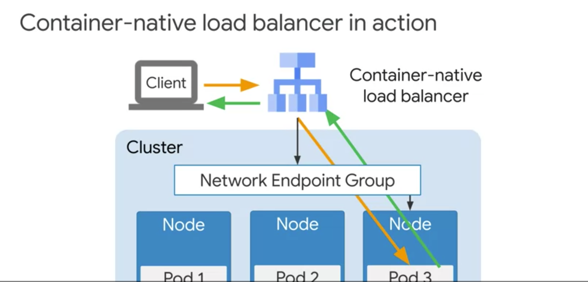

# Container-Native load Balancer 

- HTTPS/HTTP Load Balancer (= Ingress) 는 해당 pod 를 가진 node 단위로 분배한다.
- 노드 단위로 분배하기 떄문에 노드에선 pod 단위로 일정하게 분배를 하기 위해서 kube-proxy 와 소통하며 랜덤으로 파드를 고른다. 이때 노드에 있는 파드일 수도 있고, 다른 노드에 있는 pod 일 수 있다.
- 즉 두 단계의 로드 밸런싱이 있는 것이다. network load balancer 와 kube-proxy 두 요소에서 일어남. 이걸 double-hop 이라고 한다. 
  - network load balancer -> node, kube-proxy->pod 두 단계가 있어서. (이를 통해 latency 가 길어진다는 단점이 있음.)
  - 전통적인 쿠버네티스 load balancing 을 쓴다면 고려해야한다. latency 를 줄일건지, pod 간의 균등한 로드 밸런싱을 적용할건지.
- latency 를 줄일려면 `externalTrafficPolicy: local` 로 설정하면 된다. 기본 값은 `cluster` 이다. 
- GKE 를 쓴다면 GCP HTTPS Load Balancer 를 통해서 이 방법을 다른식으로 해결한다. load balancer 에서 node 를 선택하도록 하는게 아니라 pod 를 선택하도록 하는 것.
  - 이 방법은 Network endpoint groups (NEGs) 라고 부르기도 한다. 
  - NEGs 는 endpoint 들의 집합 (= 여기선 pod) 를 Ip-port pair 로 가지고 있고 이걸 로드밸런서에서 직접 연결해줌으로써 가능하다.
  - 이를 통해 균등한 로드밸런싱, source ip 보존, pod 에 대한 health check 모두 가능하다.       
 