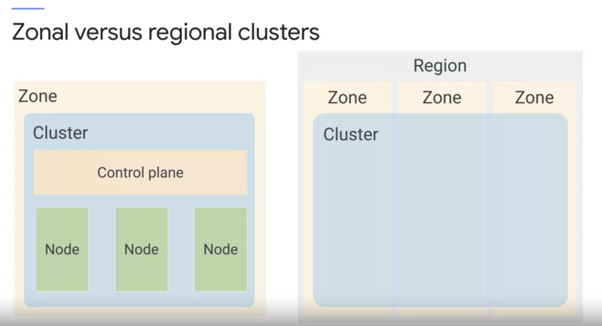

# Google Kubernetes Engine Concepts

- K8s Cluster 를 구성하는 건 꽤 많은 작업이 필요하다. 
  - open source 인 `kubeadm` 을 쓰면 초기 세팅을 해준다. 
  - 그러나 이것도 노드가 장애가 나거나 다른 유지 하는데 필요한 일이 생기면 사람이 개입해야함. 
  - 그래서 managed service 를 이용하는게 더 나을 수 있음. 
  - GKE 는 Google 에서 제공하는 Managed Servce. 
    - GKE 는 control plane 에 해당하는 모든 요소를 관리해준다.    
    - 일반적인 k8s 환경이라면 노드는 클러스터 관리자에 의해서 외부에서 만들어진다. 쿠버네티스 자체에서 만들어지지 않는다. 다만 GKE 는 이를 자동화했다.
      - 자동화는 Google 의 Compute Engine (virtual machine) 을 만들고 노드에 등록해주는 일을 해줌. 우린 이걸 cloud setting 에서 다루면 되고.
      - 노드는 Compute Engine 으로 구성되기 때문에 머신의 타입과 같은 적절한 설정을 할 수 있다. 
      - 기본은 e2-medium 으로 되는듯 (2vCPU, 4 gigabytes of memory) 
        - 이런 하드웨어 설정도 커스텀하는게 가능.  
    - 노드 풀을 자유롭게 설정하는 것도 가능하다. 
      - 노드 풀은 노드들의 subset 을 말하는 것. 클러스터 내 설정을 공유한다.
        - 노드 풀을 통해서 하드웨어 workload 를 편하게 관리하는게 가능. 
      - 작은 메모리와 cpu 만을 가진 노드들을 위한 노드 풀을 설정하는 것도 가능하고 그 반대의 노드 풀을 만드는 것도 가능하다.
      - GKE 를 시작할 떄 기본 값은 하나의 노드풀과 세 개의 노드로 시작.
    - 가용성을 위해서 Regional cluster 를 제공한다. 
      - 이건 클러스터에 접근하는 하나의 endpoint 만을 제공하지만 여기에 있는 control plane 과 node 는 이 region 안에 다양한 zone 에 있다.
      - 주의할 건 zonal cluster 로 만들었다면 regional cluster 로 변경할 수 없다는 점. 이 반대도 안됨.
      - 이 두개의 클러스터 모두 private cluster 를 지원한다. 이건 인터넷을 통한 외부 접근이 안됨. 구글 클라우드 제품만 접근 가능하거나 Authorized network 를 통해서만 가능.  

      