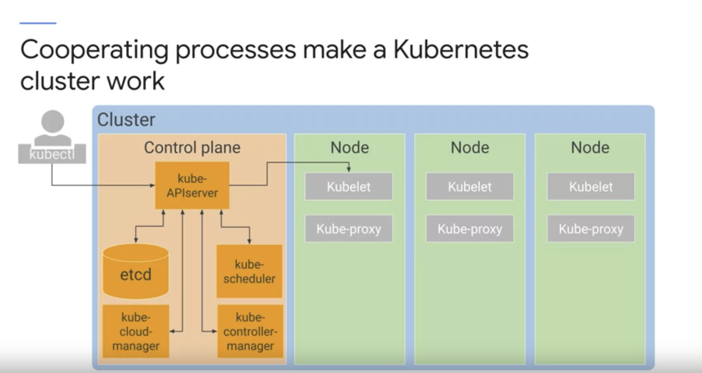

# Kubernetes Control Plane 

- 이전에 Control Plane 은 Object 의 상태를 감시하고, 올바른 상태가 아니라면 복구하는 행위를 함. 
- 여기서 정의한 Control Plane 은 Cluster 안에 포함되는 녀석임. Cluster 안에는 control plane 과 Node 가 있음.
  - control plane 은 cluster 를 coordinate 하는 역할을 한다.
    - (coordinate 는 다양한 일을 효과적으로 하기 위해 만든다 라는 뜻임.) 
    - control plane 안에서 쿠버네티스 중요한 프로세스들이 동작한다.
      - `kube-apiserver`: 나와 직접 interact 하는 component. command 를 입력받아서 object 의 state 를 볼 수 있게하고, 변경할 수 있게함.
        - (`kubectl` 명령을 할 떄 얘가 받는듯.) 
        - kube-apiserver 와 통신하는 방법은 `kubectl` 만 있는 건 아님. 내부 요소들도 kube-apiserver 에 쿼리를 날려서 소통함. 
          - 그 중 하나가 etcd 라는 클러스터 데이터베이스. 
            - etcd 는 클러스터 상태를 저장하는 reliable store 임. 모든 상태 정보가 다 저장되는 곳.  
              - 에시는 클러스터 내에 있는 노드들, 어떤 파드가 동작중이고 어디에 있는지. 
              - 나는 etcd 와 직접적으로 통신할 일은 없음.
      - `kube-scheduler`: 파드를 노드에 스케쥴링 하는 역할을 함.
        - 그래서 파드의 requirement 를 보고 어떤 노드가 제일 적합한지 선택하는 일을 한다.
          - 이 작업은 노드의 모든 상태를 알고 있기 때문에 가능하고, 내가 파드를 어떤 조건을 가진 노드에 실행하겠다를 정의하는 것도 가능하다. 
            - 주로 hardware, software, policy 에 따라 다름.
              - 예시로 파드를 특정 메모리의 양이 있는 노드에서만 실행하도록 하는게 가능하다.
              - affinity specification 을 정의하는 것도 가능하다. 그래서 pod group 이 동일한 노드에 실행되도록 할 수도 있고, 그렇게 하지 않을 수도 있다. 
        - 하지만 파드를 노드에 실제로 launching 하는 작업을 하지는 않는다. (이 작업을 해주는 component 도 있다. 이건 나중에 봄.)
      - `kube-controller-manager`: 다양한 일을 한다. `kube-apiserver` 를 통해서 클러스터의 상태를 모니터하기도 하고 올바른 상태가 아니라면 조취를 치하는 역할도 한다.
        - 많은 쿠버네티스 오브젝트들이 여기서 관리되고 여기에 `watch loop` 가 있다.
      - `kube-cloud-manager`: cloud provider 에 의해서 controller 를 관리한다. 
        - 예로 Google Kubernetes Engine 을 쓴다고 한다면 `kube-cloud-manager` 는 google cloud feature 들을 사용하도록 한다. 
          - load balancer, storage volume 의 Google Cloud 기능들.   
   
    - `node`: 각각의 노드들은 그룹을 지어서 control plane 와 같이 이룬다.
      - 노드들은 `kublet` 을 실행시킨다. 이건 node 의 agent 와 같다. 
        - kube-apiserver 가 pod 를 노드에 실행시키는 명령을 할 떄 kubelet 과 소통한다. 
        - kubelet 은 pod 를 시작하고 모니터링 하는 역할도 한다. 
          - pod 의 시작은 `container runtime` 을 이용하는데 이건 컨테이너 이미지로부터 어떻게 컨테이너를 시작할 지를 말하는 요소다. 
            - k8s 는 여러가지 container runtime 을 제공해준다.
            - GKE 가 노드에 사용하는 건 linux distribution 이고 Docker 의 런타임 구성요소인 `containerd` 를 이용한다. 
          - 모니터링은 `readiness` 와 `liveliness` 조사를 통해서 함. 그리고 이걸 `kube-apiserver` 에 보고하는 역할을 한다.
      - 노드는 `kube-proxy` 를 통해서 pod 간의 네트워크 연결을 담당한다.
        - open-source k8s 에서는 리눅스 커널에 내장된 `iptable` 의 방화벽 기능 을 이용한다.       
          