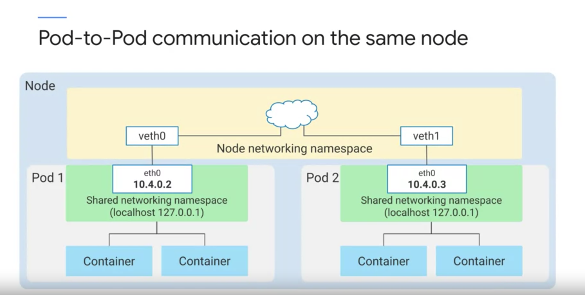

# Pod Networking 

- Kubernetes networking model 은 IP Address 에 의존한다. 
  - pod, service, container, node 는 다 IP Address 기반으로 통신한다는 듯.
- pod 는 container 들의 그룹으로 이뤄지며 container 들은 하나의 pod 에서 network 와 storage 를 공유한다.
  - 즉 IP-per-pod 이다. 각각의 pod 는 ip address 를 할당 받는다. 그리고 container 는 같은 ip-address 의 같은 namespace 를 공유한다.
  - 즉 하나의 Pod 에서 nginx 와 app 을 각각의 컨테이너로 띄운다면 이는 로컬 호스트 처럼 통신하는게 가능하다. 라는 것. (같은 namespace 가 이 뜻이다.) 그냥 같은 머신이라고 생각해도 된다.  
- k8s 는 트래픽에 대응하기 위해서 다른 종류의 로드 밸런서를 제공한다.

### Network namspace 

https://linuxhint.com/use-linux-network-namespace/

- Linux Kernel 의 기능으로 가상화를 통해 network 환경을 isolate 시키는 것.
- 이를 통해 separate network interface 와 routing table 을 가지는게 가능하다.
  - routing table 을 통해서 어떤 네트워크 호스트로 데이터를 전달하는지 알 수 있다. 

### pod-to-pod communication on the same node 

- 여기선 같은 노드에 있는 pod 끼리 통신하는 경우 어떻게 서로를 찾는지에 대한 것. 
- 일단 Pod 는 각자만의 unique 한 ip Address 를 받는다.
- 그리고 노드에 있는 pod 는 같은 network namespace 를 공유한다. (node root network namespace) 
  - node root network namespace 는 node 의 primary nic 이다.
  - 이걸 통해서 node 바깥으로 트래픽을 전송하는게 가능하다. 
  - 이를 통해서 노드에 연결된 네트워크로 파드가 트래픽을 보내는게 가능하다.
- GKE 에서는 노드에서 Pod 의 ip 할당은 VPC (Virtual private cloud) 를 통해성 이뤄진다.
  - vpc 는 논리적으로 분리된 google cloud 의 네트워크로 gke 뿐 아니라 compute engine 과 같은 곳에서도 쓰인다.
  - vpc 는 전세계 region 에 있는 다양한 ip subnets 으로 구성되어 있다.
  - gke 를 이용하면 region 과 zone 에 따라서 할당된 vpc 를 받는다. 이게 ip subnet 이고 여기에 있는 ip 들을 computing resource 에 할당하는 것.   