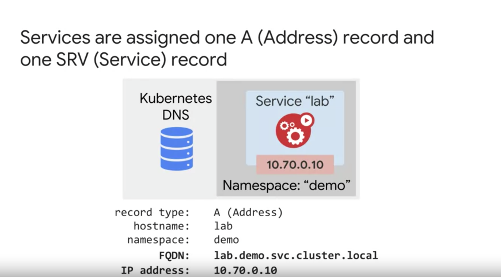
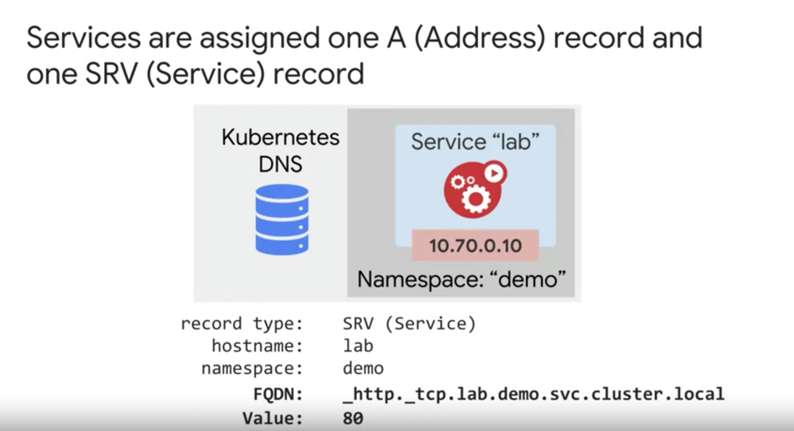

# Service 

- container 는 계속해서 변화한다. 이런 상황에서 service 는 pod 에게 안정적인 ip address 를 제공해준다. 
  - static virtual ip address 를 할당하고 이건 durable 하다.
- 이를 통해서 구체적인 pod 의 ip address 에 연결해서 커뮤니케이션 하는 것이 아니라 service 에 연결해서 커뮤니케이션한다. 
  - service 는 traffic 을 보낼 수 있는 pod 를 선택해준다.
  - service 를 이용하는 이유는 vm 같은 경우는 persistent 특성이 있지만 Pod 는 transient 특성이기 때문에. 일시적임. 새로운 ip 를 받는게 일상적.
  
## Finding services

- GKE 에서 Service 를 찾는 방법이 크게 Environment variables 과 Kubernetes DNS 방법이 있다. (pod 가 service 를 찾는 방법.)

### Environment variable

- 견고한 방법은 아님. 
- pod 에서 service host, port 정보를 환경변수를 통해서 얻는 것. 
- kubelet 은 새로운 pod 가 시작할 때 pod 와 동일한 namespace 에 있는 service 에 environment variable 을 넣는다.
- 이미 실행중인 pod 는 얻을 수 없음. 

#### Example of environment variables for a service  
```texżt
servicename_SERVICE_HOST: ex) 10.0.0.11 : The name of the service host
servicename_SERVICE_PORT: ex) 6379	 :The port for the service
servicename_PORT: ex) tcp://10.0.0.11:6379: The name of the service host
```

### Kubernetes DNS 

- `Kube DNS` 는 api-server 를 감시한다. 새로운 service 가 생성되지는 않는지. 새로운 service 가 생성되면 dns record 를 추가한다.
  - record type 은 A 이다. ip address 를 가지고 있는 거임. (SRV 타입도 있음.)
  - service 의 cluster ip 를 추가한다.
  - kube dns 는 Pod 와 service 의 dns record 를 가지고 있다. 
- `kube dns` 서버를 통해서 service name 을 통해 service ip 를 반환하도록 함.
  - 그래서 pod 는 kube dns 에 질문해서 service 를 찾을 수 있다. 
  - 같은 namespace 에 있는 service 를 찾는다면 그냥 service name 으로 물어보면 되고 다른 네임 스페이스라면 fully-qualified domain name 으로 물어봐야하거나 namespace 가 붙은 이름으로 물어봐야한다.
- kube dns 의 high performance 를 위해서 GKE 는 node 수에 비례해서 kube dns 를 스케일링 한다. 
  
#### DNS Record Example 





- headless service (without a cluster ip) 인 경우 DNS A, SRV 레코드가 할당되지만 resolve 한 결과는 service 에 의해 선택된 Pod ip 집합이다.
- normal service 의 경우에는 service 의 cluster ip 이다. 

 
 