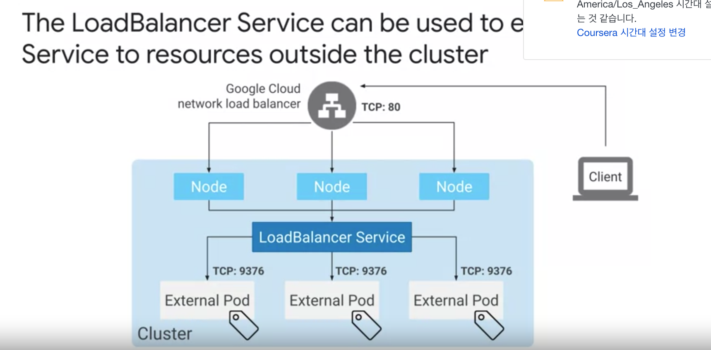

# Service Types and Load Balancers

- service 의 타입은 여러개가 있다. (clusterIP, NodePort, LoadBalancer)

## ClusterIP 

- static IP Address 를 가지고 있고 클러스터 내에서 트래픽을 분배할 때 사용가능하다. 
- 다만 클러스터 밖에서 트래픽을 받는 것은 불가능하다.

#### Example 

````yaml
apiVersion: v1 
kind: Service 
metadata: 
  name: my-service 
spec: 
  type: ClusterIP
  selector: 
    app: Backend 
  ports: 
    - protocol: TCP 
      port: 3306
      targetPort: 6000
````

- label Selector 를 통해서 target pod 를 지정하는 것이 가능하다.
- 이렇게하면 service 의 endpoint 로 pod 를 지정한다.
- port 와 targetPort 의 사용은 어떻게 되냐면 service 가 port (=3306) 으로부터 트래픽을 받으면 pod (targetPort=6000) 으로 remapping 해서 전달한다. 
- clusterIP 의 IP 는 cluster vpc 에 있는 IP pool 에서 받아온다. (이건 계속해서 지속됨. 서비스의 생애주기동안.)
- 그리고 cluster control plane 은 서비스가 요청을 받으면 service endpoint 에 포함할 파드에 요청을 전달해서 응답을 주는 것. (pod 를 선택하는 기준으로 label selector 를 통해서 이뤄진다.)

## NodePort 

- 모든 노드에 구체적인 port 를 드러내는 방법. 와부와 pod 가 소통할 수 있도록 하기 위해서. 

#### Example 

````yaml
apiVersion: v1 
kind: Service 
metadata: 
  name: my-service 
spec: 
  type: NodePort 
  selector: 
    app: Backend 
  ports: 
    - protocol: TCP
      nodePort: 30100 
      port: 80
      targetPort: 9376
````

- nodePort 는 선언하지 않으면 자동적으로 할당된다 port Range: (30,000 ~ 32,767) 사이로. 
- nodePort 를 쓰면 k8s 에 있는 모든 노드에 같은 nodeport 를 가진 프록시를 서비스에 단다고 생각하면 된다. 그래서 외부에서 요청을 받을 수 있는 것.
  - nodePort 는 clusterIP 도 내부적으로 가지고 있다. 한차원위에 nodePort 를 설정하는 것.   
- 주로 nodePort 는 k8s 에서 제공해주는 load balancer 가 아닌 자체적인 load Balancer 를 사용하고 싶을 떄 쓴다고 생각하면 된다. 이 경우에 nodePort 관리를 스스로 해야겠지. 

## LoadBalancer 

- service Type 을 loadBalancer 로 설정하면 클라우드에서 제공해주는 로드 밸런서 서비스를 이용하게된다.
- GKE 에서도 Google Cloud network load balancer 를 이용하면 됨. 



- 처리 과정을 보면 client -> Google Cloud Network LoadBalancer (= external IP Address) 로 간다.
- Google Cloud Network LoadBalancer -> Node 로 트래픽을 보내게 된다. (서비스가 있는 노드.) (노드로 트래픽을 로드밸런싱하네.)
  - cloud-controller-manager 가 external load balancer 를 할당된 nodePort 로 트래픽을 보내도록 하는 것. (내부적으로 nodePort 를 쓴다.) 
- Node -> Internal LoadBalancer 로 요청을 보내게 되고 Load Balancer -> pod 로 요청이 간다.
  - Internal LoadBalancer 는 사용해도 되고 안해도 됨. 
  - 외부에서 접근할 뿐만 아니라 내부에서도 접근해야 하는 경우가 필요할 때 쓰는듯. (즉 이떄는 두가지 서비스를 쓰는 것임.) (여기서 내부는 같은 VPC network 를 말한다. Google Cloud Region 안.)  

#### Example 

````yaml
apiVersion: v1 
kind: Service 
metadata: 
  name: my-service
  annotations:
    networking.gke.io/load-balancer-type: "Internal"
spec: 
  type: LoadBalancer 
  selector: 
    app: external  
  ports: 
    - protocol: TCP
      port: 80
      targetPort: 9376
````

- type: LoadBalancer 라고 입력하면 Google Cloud 가 static 한 LoadBalancer IP Address 를 준다. 
- 이렇게 만들면 external network load balancer 또는 internal TCP/UDP load balancer 를 만든다. 
  - `annotations: networking.GKE.io/load-balancer-type: Internal` 이라는 annotation 을 붙이면 내부용이 만들어지고 이외는 외부용이 만들어진다.
  
## Preserving the client source IP 

- target container 에서 보는 source IP 는 client IP 가 아닐 것이다. 이것을 보존하는 방법에 대해서 알아볼 것. 
- `spec.externalTrafficPolicy` 을 `local` 로 바꾸면 client IP 를 보존할 수 있다고 한다. 대신에 부하 분산이 안정적이지 않을 수 있다고 함. 기본은 `cluster` 이다.
대신에 `cluster` 는 double-hop (= second hop) 이 생기는 문제가 있을 수 있다고 함.
  - double hop 은 트래픽을 다른 노드에 있는 Pod 로 reroute 하는 과정에서 생겨날 수 있다. 근데 여기서는 hop 을 방지하기 위해서 다른 노드의 pod 로 트래픽을 변경할 때 SNAT'd (source network address translation) 과정을 거치도록 해서 막는다. 
    - 대신에 client ip 가 proxy ip 로 변경되면서 pod 로 전송해야되서 client source ip 가 proxy ip 로 변경된다. 
    - 이 과정을 없도록 하면 connection error 가 발생할 수 있기 떄문에 해야함.     
  - ￿`local` 은 load balancer 를 이용한 traffic 분배는 node 단위로 이뤄지기 떄문에 (pod 가 아님.) 그러므로 균등한 로드 밸런싱이 아닐 수 있음. (￿`local` 은 노드안에 있는 pod 로만 트래픽을 분산할 수 있다.)
    - `local` 을 쓸 경우에 그래서 `spec.healthCheckNodePort` 가 필요로 한다. pod 가 없는 노드에 트래픽이 전송된다면 drop 될 것이기 때문에.   
    - 그래서 `local` 을 쓴다면 podAntiAffinity 를 통해서 가능한 Pod 가 많은 node 에 퍼지도록 해야한다. 
- 즉 정리하자면 `spec.externalTrafficPolicy` 을 `cluster` (default) 로 쓰면 pod 간의 균등한 트래픽 분배를 할 수 있다. 대신에 client ip 가 변경된다.  
`spec.externalTrafficPolicy` 을 `local` 로 쓴다면 client IP 를 보존할 수 있지만 대신에 트래픽의 불균형이 있을 수 있다. 